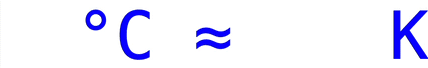

# rolling-number
**&lt;rolling-number&gt; is an easy-to-use inline Web Component**
This easy-to-use web component shows a nice rolling digit animation.



## Information

- The &lt;rolling-number&gt; component can be used out-of-the-box with a monospaced font.
- The webcomponent inherits the font-family from it's parent.
- Depending on the font-family your letterspacing will vary

## Installation

### Self hosted

Add the following to an HTML document:

```html
<script type="module" src="path/to/rolling-number.js"></script>
```

### NPM
```html
npm i @hanspeleman/rolling-number
```

## Usage

Value by fallback
```html
<rolling-number>123</rolling-number>
```
Value w/o fallback
```html
<rolling-number value="123"></rolling-number>
```
Customize roll duration
```html
<rolling-number style="--roll-duration:750ms" value="123"></rolling-number>
```

## Roadmap

- [x] Fixed inline css typo
- [x] Fixed inline css so other non-monospaced fonts are nicely aligned in each digits column
- [x] Add an observer wich will initiate the animation only when it's in view
- [x] Reset the element each time it's out of view
- [ ] Add full support for non-monospaced fonts
- [ ] Add feature the roll n-times
- [ ] ...

[](https://github.com/hanspeleman)  [](#license)
This repository is based on [@layflags/rolling-number](https://github.com/layflags/rolling-number).